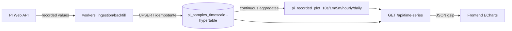
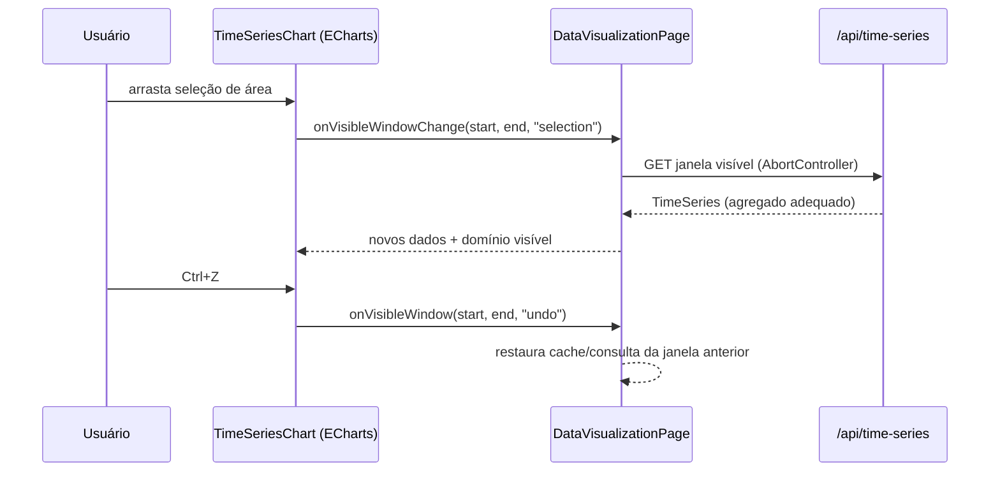

# Explicação do Sistema — PI Data Analytics

Documento técnico de manutenção descrevendo o funcionamento real do código no estado atual do repositório. Todas as afirmações citam arquivos e funções verificáveis. Itens não confirmados estão marcados explicitamente como **[não confirmado]**.

---

## 1. Visão geral da arquitetura

Componentes:

- **Frontend** (`frontend/`): React + Vite + ECharts. Página principal de visualização em `frontend/src/pages/DataVisualizationPage.tsx`, gráfico em `frontend/src/components/TimeSeriesChart.tsx` sobre `EChartsWrapper.tsx`.
- **Backend** (`backend/`): FastAPI (`backend/app/main.py`), rotas em `backend/app/api/` (destaque para `time_series.py`), serviços em `backend/app/services/`, workers em `backend/app/workers/`.
- **Integração PI Web API**: `backend/app/integrations/pi/webapi_provider.py` (cliente HTTP) e `backend/app/services/streamset_client.py` (lotes via `/streamsets`).
- **TimescaleDB**: banco histórico, migrations em `backend/alembic/versions/`.
- **Cache**: em memória, no processo do backend (`backend/app/services/cache.py`).

Fluxos:

- **Ingestão contínua**: `run_ingestion_loop` (`backend/app/workers/ingestion_worker.py`) busca janelas "vivas" (live window) por tag via `PiService.fetch_time_series` e grava com UPSERT idempotente em `pi_samples_timescale`.
- **Backfill**: `run_backfill_loop` (`backend/app/workers/backfill_worker.py`) processa jobs da tabela `pi_backfill_jobs` e rodadas automáticas `BACKFILL_ROUNDS` (R1: 0–7 dias, R2: 7–30, R3: 30–90, R4: 90–365).
- **Consulta online**: frontend → `GET /api/time-series` (`backend/app/api/time_series.py:134`) → `DatabaseTimeSeriesService.fetch_time_series`, que lê exclusivamente do TimescaleDB.

Responsabilidades: o PI Web API é a origem dos dados brutos (só acessado pelos workers); o backend orquestra consulta, autenticação e cache; o TimescaleDB é a única fonte histórica para consultas de usuário (ver §6 para nuances); o frontend renderiza e controla zoom/reconsulta.

## 2. Leitura do PI Web API

- **Cliente**: classe `PiWebApiClient` em `backend/app/integrations/pi/webapi_provider.py`. Requisições passam por `_request`/`_do_request` (retry com backoff exponencial, respeitando `Retry-After`, limitado por `pi_request_max_retries`), semáforo global de concorrência (`pi_query_concurrency`) e advisory lock PostgreSQL entre processos (`pi_query_global_lock_key`).
- **Endpoints usados** (método GET):
  - `/points?path=...` — resolução de tag → WebID (`resolve_point`, `webapi_provider.py:569`).
  - `/streams/{webId}/recorded` — valores gravados (`_values_endpoint`).
  - `/streams/{webId}/interpolated` — valores interpolados (`_interpolated_endpoint`).
  - `/streamsets/{mode}` — valores de múltiplos WebIds em uma única requisição (`backend/app/services/streamset_client.py:436`), com fallback para endpoints individuais quando o servidor não suporta StreamSet (`streamset_client.py:593-601`).
  - Endpoint de valores atuais/snapshot: **[não confirmado]** — não localizado no código atual.
- **Resolução de tag/point**: `PiService._resolve_web_id` / `_ensure_web_id` (`backend/app/services/pi_service.py`) resolvem o caminho `\\{pi_data_server_name}\{tagName}` e persistem o WebID na tabela de tags (cache `WebIdCache` em `backend/app/services/cache.py`).
- **Autenticação**: configurável em `backend/app/core/config.py` (`pi_web_api_auth_mode`: `none` ou `basic`; usuário/senha em `pi_web_api_username` / `pi_web_api_password`, senha como `SecretStr`). SSL verificável via `pi_web_api_verify_ssl`. Nenhum valor sensível é exposto aqui.
- **Modos existentes no código**: `recorded` e `interpolated` (validação em `PiService._validate_time_range`, `pi_service.py:248-259`; intervalo obrigatório no modo interpolated). Modo `plot` do PI Web API e `summary` **não são usados** para consulta no código atual — os "agregados Plot" do projeto são continuous aggregates do TimescaleDB (ver §5), conceito distinto.
- **Paginação/limites**: `max_count` por chamada (`pi_query_max_points_per_tag`, `pi_query_chunk_max_points`); o worker de ingestão divide janelas recursivamente quando `RecordedValues` atinge `max_count` (`_fetch_points`, `ingestion_worker.py:57-104`, até 12 níveis). Timeout por requisição: `pi_request_timeout_seconds` (padrão 30 s).
- **Timestamps/qualidade**: valores normalizados em `_parse_value_entry` (UTC via `_normalize_timestamp`), qualidade em três flags `good`/`questionable`/`substituted` (`_parse_quality`). Estados digitais chegam como texto em `value_text` (modelo em §5).

## 3. Ingestão no TimescaleDB

- **Worker contínuo**: `run_ingestion_loop` (`backend/app/workers/ingestion_worker.py:200`), iniciado junto ao backend (`python -m app.workers.ingestion_worker` — forma de startup confirmada pelo módulo; o acoplamento exato de processo **[não confirmado]** no deploy). Ciclo base `ingestion_cycle_seconds` (padrão 10 s); cadência RECORDED de `ingestion_recorded_cycle_seconds` (1 minuto).
- **Fonte única**: `_modes_for` retorna apenas `RECORDED` — os agregados derivam exclusivamente de valores gravados.
- **Seleção de tags**: todas as `PiTag.active`, mais as tags de limite inferior/superior associadas (loop em `run_ingestion_loop`).
- **Idempotência/conflito**: UPSERT `ON CONFLICT (tag_id, ts, source_mode) DO UPDATE` em lotes de 500 registros (`_ingest_tag`, `ingestion_worker.py:132-200`) — regrava o valor do mesmo timestamp.
- **Cursores/checkpoints**: tabela `pi_ingestion_state` (watermark por `(tag_id, source_mode)`, último erro, `next_attempt_at` com backoff exponencial limitado a 300 s). `_live_window` só persegue a borda ao vivo; lacunas históricas ficam para o backfill.
- **Cobertura**: `CoverageService.record_coverage` (`backend/app/services/coverage_service.py`) grava intervalos ingeridos em `pi_ingestion_coverage`.
- **Backfill**: jobs em `pi_backfill_jobs` com leases (`backfill_lease_seconds` = 900 s, heartbeat a cada `backfill_heartbeat_seconds`), recuperação de leases expirados (`_recover_expired_leases`), retry com backoff (`backfill_retry_base_seconds`/`backfill_retry_max_seconds`) e rodadas automáticas de 7/30/90/365 dias quando não há jobs ativos.
- **`--once`**: ambos os loops aceitam `once=True` para execução única (usado em testes e operação pontual).
- **Diferença contínuo × backfill**: contínuo mantém a janela ao vivo (últimos `ingestion_recorded_window_seconds`, com sobreposição `ingestion_overlap_seconds`); backfill preenche histórico via jobs/rodadas, com retries persistentes.
- **Deleção**: `backend/app/workers/deletion_worker.py` processa `pi_tag_deletion_jobs` **[detalhes internos não auditados nesta passada]**.

## 4. Modelo de dados

Tabelas do fluxo (todas em `backend/app/models/postgres.py`):

| Objeto | Finalidade |
|---|---|
| `pi_samples_timescale` | Hypertable base de amostras brutas (chave `tag_id, ts, source_mode`; colunas de valor por tipo `value_double/value_boolean/value_text` + flags de qualidade) |
| `pi_ingestion_state` | Checkpoint por tag/modo do worker contínuo |
| `pi_ingestion_coverage` | Intervalos ingeridos por tag/modo |
| `pi_backfill_jobs` | Jobs de recarga histórica com leases |
| `pi_tag_deletion_jobs` | Jobs de deleção de tags |

- **Hypertable**: `pi_samples_timescale` com `ts` e `chunk_time_interval => INTERVAL '1 day'` (`alembic/versions/20260910_timescaledb_native.py:69`). Compressão Hypercore após 7 dias (`add_compression_policy`, mesma migration, linha 150).
- **Continuous aggregates** (materialized views, `timescaledb.materialized_only = false`, com políticas `add_continuous_aggregate_policy` e índices `(tag_id, bucket DESC)`):
  - `pi_recorded_plot_10s` (`20260917_recorded_plot_10s.py`, atualizada em `20260918_plot_quality_filter.py`)
  - `pi_recorded_plot_hourly` e `pi_recorded_plot_daily` (`20260916_recorded_plot_aggregates.py`, recriadas em `20260918`)
  - `pi_recorded_plot_5m` (`20260921_recorded_plot_5m.py`)
  - `pi_recorded_plot_1m` (`20260922_recorded_plot_1m.py`; esta tem também `add_retention_policy` própria)
- Cada agregado calcula, por bucket, os extrema equivalentes ao "Plot" do PI (primeiro/último valor e timestamps, contagem de amostras) sobre amostras RECORDED com filtro de qualidade. Os agregados mantêm a semântica de Plot **no TimescaleDB** — não usam o endpoint Plot do PI Web API.
- `pi_recorded_plot_1m` (10 s, 1 m, 5 m, horário, diário) é o conjunto consultável; `_available_plot_aggregates` (`database_time_series_service.py:138`) detecta por `to_regclass` quais níveis estão instalados.

## 5. Consulta dos gráficos

Caminho completo:

1. Usuário submete filtros em `DataFiltersPanel` → `DataVisualizationPage` chama a API via `frontend/src/api`.
2. `GET /api/time-series` (`backend/app/api/time_series.py:134`) com `query_id`; resposta JSON gzipada quando ≥ 1 KB (`HistoricalQueryRoute`). Há também `POST /time-series/{query_id}/cancel` (cancelamento via `QueryRegistry`) e `POST /time-series/export` (CSV em streaming).
3. `DatabaseTimeSeriesService.fetch_time_series` (`backend/app/services/database_time_series_service.py:154`) resolve tags, valida período e limites.
4. **Escolha de resolução** (somente Postgres/TimescaleDB; em SQLite de teste os agregados ficam indisponíveis e cai em `_get_from_db` bruto):
   - `_plot_aggregate_for` (linha 73): faixas fixas — ≤ 6 h → 10 s; ≤ 2 d → 1 m; ≤ 14 d → 5 m; ≤ 31 d → horário; acima → diário.
   - `_dynamic_plot_plan` (linha 89): plano dinâmico por contagem bruta de pontos (`_count_qualified_raw_points`) versus alvo `pi_query_visual_default_points_per_tag` (1200); escolhe o agregado mais próximo do bucket ideal, sem dividir buckets de origem.
   - `_get_from_plot` (linha 576) lê o agregado escolhido; `_get_qualified_raw_points` lê a tabela base quando o plano usa dados brutos.
5. **Sem fallback ao PI Web API na consulta**: a docstring da classe é explícita — lacuna de cobertura resulta em erro `HistoricalDataNotLoadedError` (recarga administrativa), nunca em chamada síncrona ao PI (`database_time_series_service.py:126-133`). Códigos `query_execution.source`/`strategy` informam a origem (`timescaledb`, `timescaledb_continuous_aggregate`, `timescaledb_direct`).
6. **Cache**: `VisualCache` e `WebIdCache` (`backend/app/services/cache.py`) com TTLs `pi_cache_visual_recent_ttl_seconds` / `pi_cache_visual_historical_ttl_seconds` e limite `pi_cache_visual_max_total_points`; cache de resultado TimescaleDB com `timescaledb_query_cache_ttl_seconds`. Chave visual inclui tags, janela e modo **[composição exata da chave: ver `VisualCache` — não auditada linha a linha]**.
7. **Zoom no frontend**: seleção de área em `TimeSeriesChart` dispara `dataZoom` do ECharts → `handleDataZoom` empurra snapshot no histórico e chama `props.onVisibleWindowChange(start, end, "selection")` → `handleVisibleWindowChange` (`DataVisualizationPage.tsx:1241`) consulta a nova janela com `AbortController` e sequência `zoomRequestSeqRef` (respostas obsoletas viram `"superseded"` e são descartadas); cache `zoomCacheRef` evita reconsultas repetidas. Ctrl+Z restaura o snapshot com `reason: "undo"` — mesmo caminho, uma reconsulta por desfazer temporal.
8. **maxDataPoints / intervalos**: alvo por tag de 1200 pontos (`pi_query_visual_default_points_per_tag`); intervalos/limites validados por `pi_query_planner.py` (`build_plan_for_visual`, `validate_visual_budget`).

A política Plot × Recorded no código é: histórico sempre via agregados Plot do TimescaleDB (ou base bruta quando o plano decide); RECORDED é a fonte de ingestão e o modo de consulta bruto; INTERPOLATED existe como modo de consulta/ingestão legado de janelas curtas (`_window_for` ainda contempla `INTERPOLATED_10S`/`INTERPOLATED_300S`, embora `_modes_for` hoje só produza RECORDED).

## 6. Diagramas

Fluxo macro:



Zoom e reconsulta:



Exemplo sanitizado de requisição:

```json
GET /api/time-series?query_id=<uuid>&start_time=2026-09-10T15:27:00Z&end_time=2026-09-10T15:27:10Z&tag_ids=1&mode=recorded
```

Exemplo sanitizado de registro ingerido (`pi_samples_timescale`):

```json
{"tag_id": 1, "ts": "2026-09-10T15:27:05Z", "value_type": "double", "value_double": 5.0, "good": true, "questionable": false, "substituted": false, "source_mode": "RECORDED"}
```

## 7. Operação e diagnóstico

- **Workers**: `python -m app.workers.ingestion_worker` e `python -m app.workers.backfill_worker` (módulos executáveis; compose em `compose.timescale.yml` orquestra os serviços — **detalhe dos comandos do compose: confirmar no arquivo**).
- **Backend**: `uvicorn app.main:app` **[entrypoint exato não confirmado no main.py nesta passada]**; CLI administrativa: `python -m app.cli create-admin --username ...` (`backend/app/cli/__main__.py`).
- **Frontend**: `npm run dev` (Vite), `npm run build` (`tsc -b && vite build`), `npm test` (Vitest).
- **Variáveis de ambiente** (nomes, sem valores): `DATABASE_URL`, `DATABASE_PASSWORD`, `PI_WEB_API_BASE_URL`, `PI_WEB_API_AUTH_MODE`, `PI_WEB_API_USERNAME`, `PI_WEB_API_PASSWORD`, `PI_WEB_API_VERIFY_SSL`, `PI_DATA_SERVER_NAME`, `PI_REQUEST_TIMEOUT_SECONDS`, `PI_REQUEST_MAX_RETRIES`, `PI_QUERY_*`, `PI_CACHE_*`, `INGESTION_*`, `BACKFILL_*`, `AUTH_JWT_SECRET`, `AUTH_COOKIE_*`.
- **Logs**: `workers.ingestion` (`ingestion_cycle_completed`, `ingestion_circuit_open` após 3 falhas), worker de backfill (`backfill_run_completed`, `backfill_run_failed`).
- **Diagnóstico**: atraso de ingestão por `pi_ingestion_state.watermark_ts`/`last_source_ts`; cobertura por `pi_ingestion_coverage`; jobs de backfill por `pi_backfill_jobs` (status, lease, tentativas); agregados por `to_regclass` (o próprio `_available_plot_aggregates` faz isso) e políticas em `timescaledb_information.*`.
- **Limitações confirmadas**: consulta de usuário sem fallback ao PI; erro TS preexistente em `TimeSeriesChart.tsx:435` (formatter, presente antes desta alteração); histórico de zoom do gráfico guarda percentuais relativos ao domínio em vigor no momento do zoom, e após reconsulta de zoom confirmado o domínio muda sem zerar `zoomHistoryRef`/`currentZoomRef` (`frontend/src/components/TimeSeriesChart.tsx:1050-1052`) — desfazimentos sucessivos além do primeiro podem restaurar percentuais com base de domínio distinta; correção exige mexer na criação do histórico (área congelada nesta tarefa).

## 8. Fontes por seção

- §1: `backend/app/main.py`, `backend/app/api/time_series.py`, `frontend/src/pages/DataVisualizationPage.tsx`.
- §2: `backend/app/integrations/pi/webapi_provider.py`, `backend/app/services/streamset_client.py`, `backend/app/services/pi_service.py`, `backend/app/core/config.py`.
- §3: `backend/app/workers/ingestion_worker.py`, `backend/app/workers/backfill_worker.py`, `backend/app/services/coverage_service.py`.
- §4: `backend/app/models/postgres.py`, `backend/alembic/versions/20260910_timescaledb_native.py` e `2026091[6-8]_*.py`, `2026092[0-2]_*.py`.
- §5: `backend/app/services/database_time_series_service.py`, `backend/app/services/pi_query_planner.py`, `backend/app/services/cache.py`, `frontend/src/components/TimeSeriesChart.tsx`, `frontend/src/pages/DataVisualizationPage.tsx`.
- §7: `backend/app/cli/__main__.py`, `frontend/package.json`, `compose.timescale.yml`.